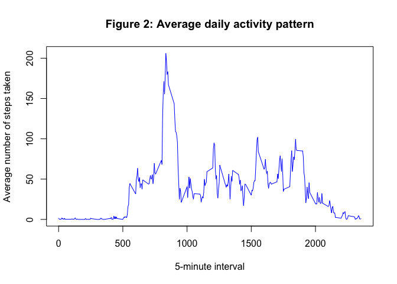
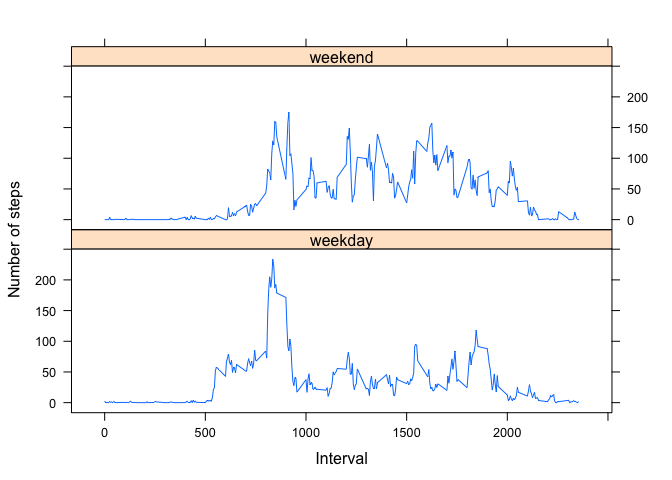

# Reproducible Research: Peer Assessment 1

## Loading and preprocessing the data

```r
df.original <- read.csv(unz("activity.zip", "activity.csv"))
```


## What is mean total number of steps taken per day?
#### 1) Total number of steps taken each day (histogram)

```r
steps_per_date <- aggregate(steps~date, data=df.original, FUN=sum)
barplot(steps_per_date$steps, col="BLUE", main="Figure 1: Total number of steps taken per day")
axis(1,at=steps_per_date$date, labels=steps_per_date$date)
```

 

#### 2) Mean and median total number of steps taken per day


```r
mean(steps_per_date$steps)
```

```
## [1] 10766.19
```

```r
median(steps_per_date$steps)
```

```
## [1] 10765
```
The __mean__ total number of steps taken per day is: 10766.19  
The __median__ total number of steps taken per day is: 10765  


## What is the average daily activity pattern?
#### 1) Time series plot of the 5-minute interval (x-axis) and the average number of steps taken, averaged across all days (y-axis)

```r
steps_per_interval <- aggregate(steps~interval, data=df.original, FUN=mean)
plot(steps_per_interval, type="l", col="blue", main="Figure 2: Average daily activity pattern", xlab="5-minute interval", ylab="Average number of steps taken")
```

 

#### 2) Which 5-minute interval, on average across all the days in the dataset, contains the maximum number of steps?

```r
steps_per_interval$interval[which.max(steps_per_interval$steps)]
```

```
## [1] 835
```
Interval 835 contains the maximum number of steps, on average across all the days in the dataset.


## Imputing missing values
#### 1) Total number of missing values in the dataset

```r
sum(is.na(df.original$steps))
```

```
## [1] 2304
```
There are 2304 rows with ```NA```s.


#### 2) Strategy for filling in all of the missing values in the dataset
The strategy chosen here is to use the mean for that 5-minute interval.


#### 3) New dataset with the missing data filled in

```r
df.filled <- merge(df.original, steps_per_interval, by="interval")
df.filled$steps[is.na(df.original$steps)] <- df.filled$steps.y[is.na(df.original$steps)]
df.filled <- df.filled[, c(1:3)]
```


#### 4) Make new histogram. Calculate new mean and median total number of steps taken per day. Any differences with the original dataset?

```r
steps_per_date_filled <- aggregate(steps.x~date, data=df.filled, FUN=sum)
barplot(steps_per_date_filled$steps.x, col="BLUE", main="Figure 3: Total number of steps taken per day (filled data)")
axis(1,at=steps_per_date_filled$date, labels=steps_per_date_filled$date)
```

 


```r
mean(steps_per_date_filled$steps.x)
```

```
## [1] 10766.19
```

```r
median(steps_per_date_filled$steps.x)
```

```
## [1] 10765
```
The __mean__ total number of steps taken per day is: 10766.19  
The __median__ total number of steps taken per day is: 10765  
There is virtually no impact of imputing missing data on the estimates of th etotal daily number steps.  


## Are there differences in activity patterns between weekdays and weekends?
#### 1) Create a new factor variable in the dataset with two levels – “weekday” and “weekend”

```r
weekday_index <- weekdays(as.Date(df.filled$date)) %in% c("Monday", "Tuesday", "Wednesday", "Thursday", "Friday")
df.filled$weekday_weekend <- ifelse(weekday_index, "weekday", "weekend")
```

#### 2) Panel plot containing a time series plot of the 5-minute interval (x-axis) and the average number of steps taken, averaged across all weekday days or weekend days (y-axis)

```r
# prepare data
df.weekday <- aggregate(steps.x~interval, data=subset(df.filled, weekday_weekend=="weekday"), FUN=mean)
df.weekday$weekday_weekend <- "weekday"
df.weekend <- aggregate(steps.x~interval, data=subset(df.filled, weekday_weekend=="weekend"), FUN=mean)
df.weekend$weekday_weekend <- "weekend"
df.xyplot <- rbind(df.weekday, df.weekend)
# plot data
library(lattice)
xyplot (steps.x~interval|weekday_weekend, data=df.xyplot, type="l", layout=c(1,2), xlab="Interval", ylab="Number of steps")
```

 
  
This plot shows that:  
* average activity during the weekend starts later than in weekday  
* average activity during the weekend is higher than in weekday  
* average activity pick is higher in weekday than in weekend
